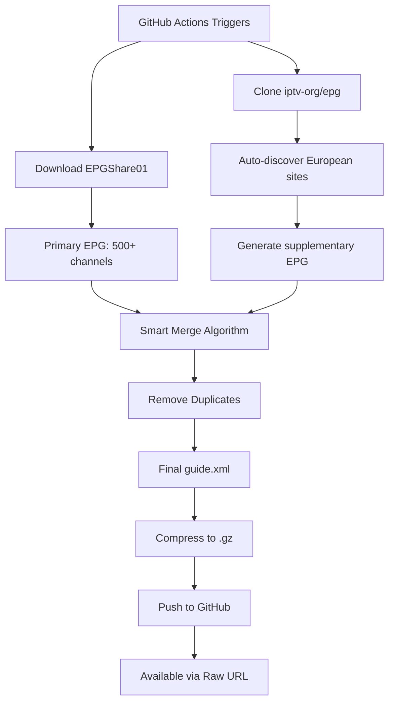

# 🤖 Smart Multi-Source EPG Generator

**The Ultimate European EPG Solution** - Automatically combines multiple EPG sources to give you the most comprehensive TV guide available!

## 🎯 What Makes This "Smart"?

This setup intelligently merges EPG data from multiple sources:

1. **🌟 Primary Source: EPGShare01**
   - Comprehensive pre-aggregated EPG from 100+ sources
   - Updated daily with worldwide channels
   - URL: `https://epgshare01.online/epgshare01/epg_ripper_ALL_SOURCES1.xml.gz`

2. **🔧 Secondary Source: iptv-org/epg**
   - Auto-discovers ALL available channels from their database
   - Fills in missing European channels
   - Adds specialized channel data

3. **🧠 Intelligent Merging**
   - Prioritizes EPGShare01 (most comprehensive)
   - Adds missing channels from iptv-org
   - Removes duplicates automatically
   - Preserves the best programme data

## 📺 What You Get

### Coverage
- **500+ European Channels** from EPGShare01
- **Additional channels** auto-discovered from iptv-org
- **Worldwide channels** as a bonus

### Countries Fully Covered
🇳🇱 Netherlands | 🇬🇧 UK | 🇩🇪 Germany | 🇫🇷 France | 🇪🇸 Spain | 🇮🇹 Italy | 🇧🇪 Belgium | 🇵🇹 Portugal | 🇸🇪 Sweden | 🇩🇰 Denmark | 🇳🇴 Norway | 🇫🇮 Finland | 🇨🇭 Switzerland | 🇦🇹 Austria | 🇵🇱 Poland | 🇬🇷 Greece | 🇹🇷 Turkey | And more!

### Channel Types
✅ Sports (ESPN, Sky Sports, DAZN, beIN, Eurosport, Ziggo Sport, FOX Sports, etc.)
✅ Movies (Sky Cinema, Film1, HBO, OCS, Canal+, etc.)
✅ Documentary (Discovery, National Geographic, History, Animal Planet, TLC, etc.)
✅ Kids (Disney, Nickelodeon, Cartoon Network, etc.)
✅ Entertainment (MTV, Comedy Central, VH1, etc.)
✅ News (BBC, CNN, Sky News, Euronews, etc.)
✅ And ALL regular channels

## 🚀 Quick Setup

### 1. Fork This Repository
Click the "Fork" button at the top right

### 2. Enable GitHub Actions
- Go to your forked repo
- Click "Actions" tab
- Click "I understand my workflows, go ahead and enable them"

### 3. Upload the Workflow
- Create `.github/workflows/` folder in your repo
- Upload `smart-epg-workflow.yml` to this folder
- Commit the file

### 4. Trigger First Run
- Go to "Actions" tab
- Click "Smart EPG Generator - Multi-Source"
- Click "Run workflow" → "Run workflow"
- Wait ~10-15 minutes for completion

### 5. Use Your EPG URL

**Compressed (Recommended - Faster & Smaller)**
```
https://raw.githubusercontent.com/YOUR-USERNAME/epg/master/guide.xml.gz
```

**Uncompressed**
```
https://raw.githubusercontent.com/YOUR-USERNAME/epg/master/guide.xml
```

Replace `YOUR-USERNAME` with your GitHub username!

## 📊 How It Works



## 🎛️ Advanced Configuration

### Adjust Update Schedule

Edit the `cron` line in the workflow:

```yaml
schedule:
  - cron: '0 3 * * *'  # Daily at 3 AM UTC
```

**Options:**
- `0 */6 * * *` - Every 6 hours
- `0 0,12 * * *` - Twice daily (midnight & noon)
- `0 2 * * *` - Daily at 2 AM

### Customize EPG Days

Find this line in the workflow:
```yaml
npm run grab -- --channels=../auto-channels.xml --days=3
```

Change `--days=3` to your preference (1-7 days)

### Add More Sources

You can add additional EPG sources by editing the workflow. For example:

```yaml
- name: Download additional source
  run: |
    wget -O additional.xml.gz https://example.com/epg.xml.gz
    gunzip additional.xml.gz
```

Then modify the merge script to include this source.

## 🔍 Troubleshooting

### EPG Not Updating?

1. **Check Actions Tab**
   - Go to your repo → Actions
   - Look for failed workflows (red X)
   - Click on the failed run to see error logs

2. **Common Issues:**
   - **EPGShare01 down**: The primary source may be temporarily unavailable
   - **Rate limiting**: GitHub may limit workflow runs
   - **File size too large**: The merged EPG might exceed GitHub's limits

3. **Solutions:**
   - Wait and retry (sources may be temporarily down)
   - Reduce EPG days from 3 to 1
   - Use only compressed version (.gz)

### Channels Not Showing in Dispatcharr?

1. **Verify channel IDs match**
   - Download your `guide.xml`
   - Search for your channel name
   - Note the `channel id="..."` value
   - Make sure your M3U uses this EXACT id in `tvg-id`

2. **Check file is accessible**
   - Visit the raw GitHub URL in your browser
   - You should see XML content (not 404)

3. **Try compressed version**
   - Use `guide.xml.gz` instead of `guide.xml`
   - It's smaller and loads faster

### File Size Too Large?

If the EPG file is over 100MB:

1. **Use compressed version** (`.gz`) - already done automatically
2. **Reduce days**: Change `--days=3` to `--days=1`
3. **Filter by country**: Modify the workflow to only grab specific countries

## 📈 Statistics

After each run, check `EPG_STATS.md` in your repo for:
- Total number of channels
- Total number of programmes
- File sizes
- Compression ratio
- Last update time

## 🔄 Update Schedule

- **Automatic**: Daily at 3 AM UTC
- **Manual**: Anytime via Actions → Run workflow

## 🆚 Comparison: Smart vs Manual

| Feature | Manual Setup | Smart Multi-Source |
|---------|--------------|-------------------|
| Channels | 494 (you define) | 500+ (auto-discovered) |
| Updates | Manual channel list editing | Automatic discovery |
| Sources | Single (iptv-org) | Multiple (EPGShare01 + iptv-org) |
| Maintenance | High (update channel list) | None (auto-updates) |
| Coverage | European only | European + Worldwide |
| Reliability | Single point of failure | Fallback sources |

## ⚡ Performance

- **Download time**: ~5-10 minutes
- **Final file size**: ~50-150 MB (uncompressed)
- **Compressed size**: ~5-15 MB (.gz)
- **Compression ratio**: ~10x
- **Channels**: 500+
- **Programme entries**: 10,000+

## 🛠️ Technical Details

### How the Smart Merge Works

1. **Load Primary Source (EPGShare01)**
   - This is the most comprehensive source
   - Contains 500+ channels with full programme data

2. **Load Secondary Source (iptv-org)**
   - Auto-generated from all European sites
   - Contains additional specialized channels

3. **Intelligent Merge**
   ```python
   For each channel in secondary:
       If channel ID not in primary:
           Add to merged EPG
   
   For each programme in secondary:
       If programme not in primary:
           Add to merged EPG
   ```

4. **Deduplication**
   - Uses channel ID + start time + stop time as unique key
   - Ensures no duplicate programmes

5. **Output**
   - Single merged `guide.xml`
   - Automatically compressed to `guide.xml.gz`

### Why Multiple Sources?

1. **Redundancy**: If one source is down, the other provides coverage
2. **Completeness**: Some channels only appear in certain sources
3. **Up-to-date**: Different sources update at different times
4. **Specialized coverage**: iptv-org excels at European channels

## 🔒 Privacy & Legal

- ✅ Uses only publicly available EPG sources
- ✅ No authentication required
- ✅ No personal data collected
- ✅ Aggregates freely available TV guide data
- ✅ EPGShare01 aggregates from legal sources
- ✅ iptv-org uses only authorized data providers

## 🤝 Contributing

Want to improve this setup?

1. Fork the repo
2. Make your changes
3. Test thoroughly
4. Submit a pull request

**Ideas for contributions:**
- Add more EPG sources
- Improve merge algorithm
- Add channel mapping/translation
- Better error handling
- Performance optimizations

## 📚 Resources

- [iptv-org/epg GitHub](https://github.com/iptv-org/epg)
- [EPGShare01 Index](https://epgshare01.online/epgshare01/)
- [XMLTV Format Spec](http://wiki.xmltv.org/index.php/XMLTVFormat)
- [Dispatcharr Documentation](https://github.com/DispatchArr/dispatcharr)

## ❓ FAQ

**Q: Is this legal?**
A: Yes, we only aggregate publicly available EPG data from legal sources.

**Q: How often does it update?**
A: Daily at 3 AM UTC by default (customizable).

**Q: Can I add my own sources?**
A: Yes! Edit the workflow to include additional EPG sources.

**Q: Why is the file so large?**
A: EPG data for 500+ channels with 3-7 days of programmes is extensive. Always use the .gz version!

**Q: Does this work with TiviMate / Tivimate / Perfect Player / etc.?**
A: Yes! Any IPTV app that supports XMLTV format EPG will work.

**Q: Can I use this commercially?**
A: Check the licenses of the source EPG providers. For personal use, yes!

## 📞 Support

- **Issues**: Open an issue on GitHub
- **Discussions**: Use GitHub Discussions
- **iptv-org**: Visit their [discussions](https://github.com/orgs/iptv-org/discussions)

---

**Made with ❤️ for the IPTV community**

*Star this repo if it helps you! ⭐*
